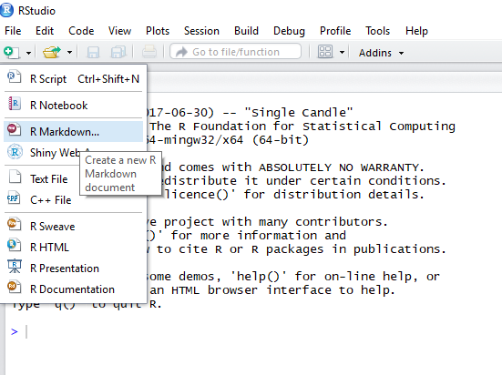
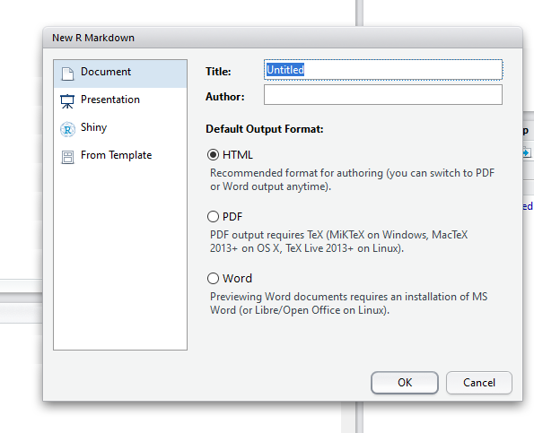
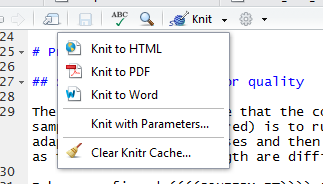

Complete, neat and thorough documentation of our research is something that we probably all aim to achieve. In the wet lab, lab notebooks are essential and some labs are migrating to online versions like [LabArchives](https://mynotebook.labarchives.com/login). For bioinformaticians, documentation of code commonly goes on [GitHub](http://github.com/). However, as a biologically-trained student entering the realm of bioinformatics it was not always clear how best to document my analyses, as this most often involved using commands to run other people's code rather than writing my own. I moved to writing short bash scripts to run different tools, but there was still an awful lot I wanted to write down regarding what I was learning as I went, not to mention the importance of recording everything that went *wrong*.

## In the past

Initially, I was using LabArchives for this documentation, where I would copy over the commands I had run and attach output files or screenshots of output. This was okay for a while; it had the benefit of timestamped entries and I highly recommend it for wet lab experiments, protocols and as a place to start for documenting your computational stuff. However, I felt that it became a bit messy and difficult to navigate as I was exploring different methods - particularly when I started doing analysis in R as well.

I arrived at [R Markdown](http://rmarkdown.rstudio.com/) when I was beginning to learn R. I began by using R scripts to document my R code, but soon realised that I wanted to write more about what I was doing than looked neat amongst all the `######`. I also needed to continue documenting the work I was doing on the command line, and wanted to keep everything in once place. I now use R Markdown daily to document almost every command I type. I find it a fantastic way to keep track of the different things I may be doing; including running some commands on my data, installing and learning how to use a new tool or working through errors or problems in my data. I use a separate R Markdown document for each separate thing and name them appropriately so it is easy for me to revisit.

## What is R Markdown?

My best explanation of R Markdown is that it is **my primary tool for keeping thorough, reproducible documentation of my bioinformatics analyses**. My poor explanation of what it *actually* is is that it's a tool to generate nice-looking reports with plain text (the markdown part) and embedded code (the R part). Importantly, the document will not be created unless the R code functions, because it runs the code as it creates your report. This means you have documentation containing the exact code that works; no typos. You can also have code blocks with other languages like `bash`. [knitr](https://yihui.name/knitr/) is the important package that supports text written in R Markdown and turns it into something that looks nice; so this is referred to as "knitting" the document. Commonly, you will `knit` your document into a HTML page, or if you have `pandoc` installed, into a PDF.


[LaTeX](https://www.latex-project.org/) produces the same pleasant-looking documents and is something I had intended to learn, however I have found R Markdown/knitr much more straightforward; the downside is that you have [less control](https://yihui.name/en/2013/10/markdown-or-latex/) over how printable pages will look. 

## Get started with R Markdown (on Windows)

The R Markdown website has some great [tutorials](http://rmarkdown.rstudio.com/lesson-1.html), but I will admit that I haven't watched these - I just got stuck into it. It may *look* tricky to learn, as the `font in the plain text window looks like code`, which may turn you off if you are unfamiliar with the command line. However, I promise that it is super easy to use and once you know the basics you just focus on the writing. Here is how I set up R Markdown as I use it each day on my Windows machine:

### 1. Install [R](https://cran.r-project.org/mirrors.html) and [RStudio](https://www.rstudio.com/products/rstudio/download).
If you want to be able to produce R Markdown documents as PDFs, you will also need to install [MiKTeX](https://miktex.org/download) but note that you need the *complete* installation by using the Net Installer. (I found that the MiKTeX download would interrupt and it cannot be resumed; downloading and installing [proTeXt](http://tug.org/protext/) worked better for me.)

### 2. Open R studio
and select to create a new R Markdown document



### 3. Hit yes
to install all of the R packages required for R Markdown.

In my case, `knitr` and `rmarkdown` didn't install this way.  If this happens, in the console window of RStudio type:

```{r}
install.packages("knitr")
install.packages("rmarkdown")
```

Then you will need to select to open a new R Markdown document again.

### 4. Name your document
and select the output type - as it says, you can select HTML and then later convert to PDF (if you have MiKTeX installed).



### 5. Load any R packages at the top
If you will be writing R code that requires you to load installed packages, you can write them at the top (underneath `knitr::opts_chunk$set(echo = TRUE)`) as `library(packagename)` like so:


### 6. Start writing! 
There is a neat [cheat sheet](https://www.rstudio.com/wp-content/uploads/2016/03/rmarkdown-cheatsheet-2.0.pdf) which should cover everything you need. It can be a bit much to look at, so here is a list of the syntax I use most frequently (these are in the "Pandoc's Markdown" section):

* **Headers.** Begin a line with `#` and you have a level 1 header - add more `#`s for subheadings and beyond. The font size will decrease accordingly.
* **Bullet points.** Begin a line with `*` followed by a space to create a bullet point. Sub-points are done with `+` after a tab indent.
* **Numbered lists.** As simple as beginning a line with `1.` followed by a space.
* **Bold** and *italic*; use two asterisks around the text `**like so**` for bold and `*one*` for italic.
* **Inserting pictures.** Do so with `` where you put the description of the picture within the square brackets, and the path to the image file in parentheses.

For the code blocks where I write lines of R code, I begin a code block with ` ```{r}`. The following lines contain the code, then the block ends with ` ``` ` . For bash code, where I record the commands I run in bash scripts and for command line tools, `{r}` becomes `bash`. In both types of code you can use `#` to begin a comment line, which are useful to provide information on what the code is doing without having to break it up into small blocks with text around them.

### 7. Knit the document. 
You can create a HTML output (viewable in an internet browser) or a PDF document. Sometimes, I don't knit the document at all - you don't have to.

To Knit, just hit knit! You can choose the output type if you use the little arrow beside it.




Easy! There is much more to learn, but I primarily use R Markdown the above features are what I most commonly use. My habit is to write the outline for what I'm planning to do and why (like a protocol), then run the commands (do the experiment) before copying them into the document and writing about what happened (writing in a lab notebook).

In fact, it's quite reasonable to **use R Markdown as a lab notebook** if you do a lot of computational work; see how [Tim Stuart](http://timoast.github.io/2017/04/03/comp-notebook/) does this. As he describes, if you do lots of analysis, having several separate R Markdown documents can also get messy so there is an advantage to going a step further to keep them all in the one place.

I hope that this was a straightforward introduction to R Markdown and that you will consider using it or something similar to document your bioinformatics analysis if you don't do so already (or if `history > log.txt` is as far as you go). It's good for yourself, your papers (I'm building a habit of providing a link in the paper to all my documented analysis, which I host on GitHub Pages) and your supervisors or collaborators if they would like to see *exactly* what you've done, which can be useful for all involved.

If you have any comments or questions, please [email me](mailto:rachael.lappan@gmail.com) or find me on [Twitter](https://twitter.com/RachaelLappan).
